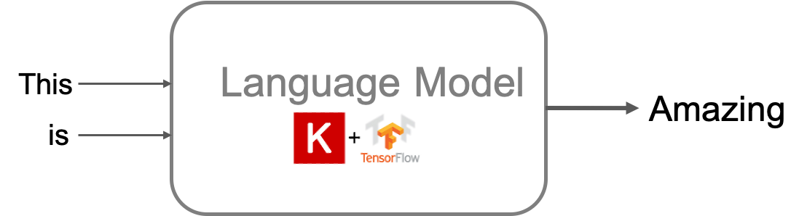

# Text Generation

This repository contains resources for springboard session on Text Generation to be presented on May 30th, 2020.
The following topics are covered:
+ Understanding Language
+ Understanding RNNs
+ Sequence to Sequence Modeling
+ Language Modeling
+ Training a Text Generator from Scratch (RNN)
+ Decoding Strategies
  - Greedy
  - Beam Search
  - Sampling
  - Top-k Sampling
  - Top-p Sampling/Nucleus Sampling
+ Encoder-Decoder Architecture
+ Transformers 🤗
+ GPT2 based Text Generation

---
> This was made possible due to amazing work by folks at Tensorflow, HuggingFace and numerous researchers (I have tried citing them wherever possible)
---
